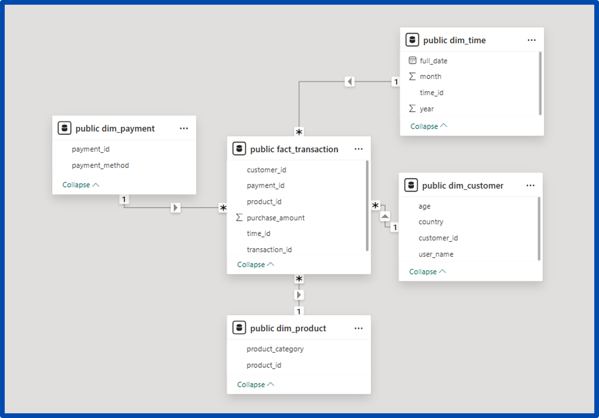
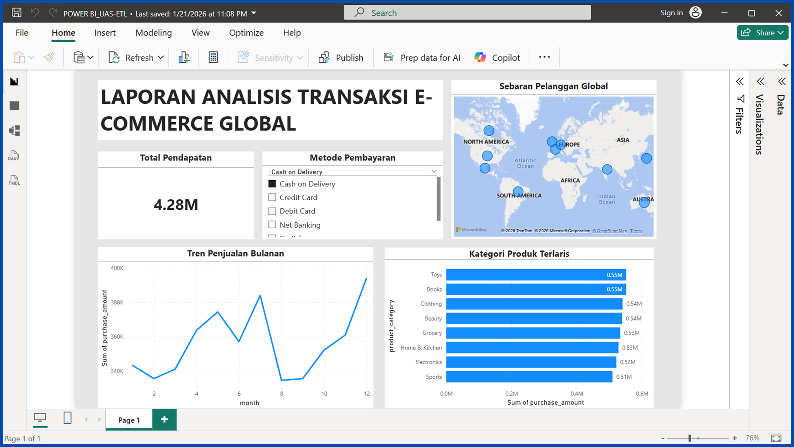

# Data Warehouse Implementation for E-Commerce Global Transaction Analytics

An end-to-end ETL pipeline and dimensional data warehouse built to support analytical reporting on global e-commerce transaction data. The pipeline is implemented using Pentaho Data Integration, stored in PostgreSQL with a Star Schema design, and visualized through a Power BI dashboard.

---

## Background

The source data consists of raw e-commerce transaction records in CSV format that are difficult to analyze historically in their original form. This project addresses the following business problems:

- Difficulty monitoring monthly sales trends efficiently
- No visibility into which product categories and payment methods perform best
- Lack of geographic distribution analysis for customers

---

## Architecture

```
[Source Data: CSV (Kaggle)]
          |
          v
[ETL Layer: Pentaho Data Integration]
   |-- dim_product.ktr
   |-- dim_customer.ktr
   |-- dim_payment.ktr
   |-- dim_time.ktr
   |-- fact_transaction.ktr
   |-- job_master_ecommerce.kjb  (Orchestrator)
          |
          v
[Data Warehouse: PostgreSQL — Star Schema]
          |
          v
[BI Layer: Power BI Dashboard (OLAP)]
```

---

## Data Model — Star Schema



### Fact Table

| Table | Description |
|---|---|
| `fact_transaction` | Contains transactional measures (`purchase_amount`) and foreign keys to all dimension tables |

### Dimension Tables

| Table | Key Columns |
|---|---|
| `dim_product` | `product_key`, `product_category` |
| `dim_customer` | `customer_key`, `user_name`, `age`, `country` |
| `dim_payment` | `payment_key`, `payment_method` |
| `dim_time` | `time_key`, `day`, `month`, `year`, `quarter` |

---

## ETL Pipeline

### Source Data

**File:** `ecommerce_transactions.csv`  
**Columns:** `Transaction_ID`, `User_Name`, `Age`, `Country`, `Product_Category`, `Purchase_Amount`, `Payment_Method`, `Transaction_Date`

### Transformation Files

| File | Description |
|---|---|
| `dim_product.ktr` | Extract and load product category dimension |
| `dim_customer.ktr` | Extract customer information and generate surrogate keys |
| `dim_payment.ktr` | Extract payment method dimension |
| `dim_time.ktr` | Parse transaction date into day, month, year, and quarter |
| `fact_transaction.ktr` | Load fact table with foreign key lookups to all dimensions |
| `job_master_ecommerce.kjb` | Master job that orchestrates all transformations in sequence |

### ETL Stages

1. **Extract** — Read raw data from the source CSV file
2. **Transform** — Remove duplicates, standardize formats, generate surrogate keys, and parse date fields
3. **Load** — Load dimension tables first, then the fact table into PostgreSQL

---

## Dashboard



## Key Business Insights

| No | Insight |
|---|---|
| 1 | **Top Categories:** Sports and Toys are the highest revenue contributors (combined >10M) |
| 2 | **Seasonal Trend:** Significant sales spike observed in October through December |
| 3 | **Market Distribution:** Global customer base with high concentration in North America and Europe |

---

## Tech Stack

| Layer | Technology |
|---|---|
| Data Source | CSV (Kaggle) |
| ETL | Pentaho Data Integration (PDI / Kettle) |
| Data Warehouse | PostgreSQL |
| BI & Visualization | Power BI |
| Data Modeling | Star Schema (Dimensional Modeling) |

---

## Project Structure

```
├── ecommerce_transactions.csv   # Raw source data
├── job_master_ecommerce.kjb     # Master Pentaho job
├── dim_product.ktr              # ETL: Product dimension
├── dim_customer.ktr             # ETL: Customer dimension
├── dim_payment.ktr              # ETL: Payment dimension
├── dim_time.ktr                 # ETL: Time dimension
├── fact_transaction.ktr         # ETL: Fact table
└── README.md
```

---

## How to Run

### Prerequisites

- Pentaho Data Integration (PDI) 9.x
- PostgreSQL 13+
- Power BI Desktop

### Steps

1. Create a PostgreSQL database and run the DDL scripts to initialize the dimension and fact tables.
2. Update the database connection settings in Pentaho (host, port, username, password).
3. Open `job_master_ecommerce.kjb` in Pentaho and execute the master job.
4. Connect Power BI to the PostgreSQL database and open the `.pbix` file to view the dashboard.

---

## Author

**Zahrotun Nafisah** — NIM: 21422008  
Email: 21422008.student@unusida.ac.id  
Institution: Universitas Nahdlatul Ulama Sidoarjo (UNUSIDA)
